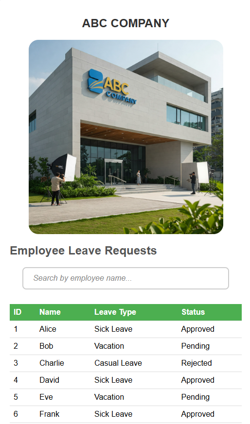
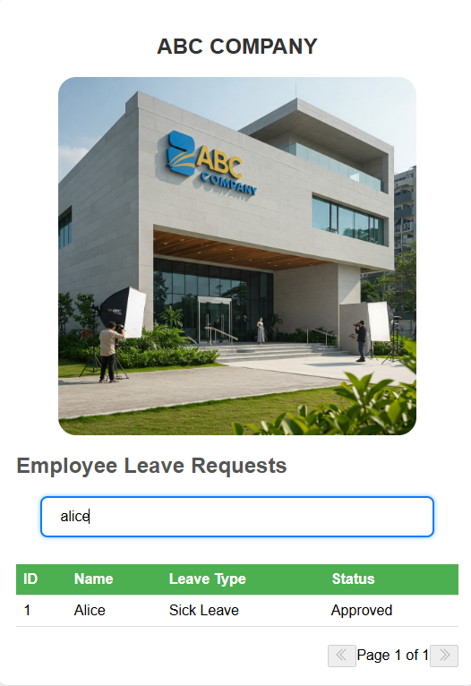
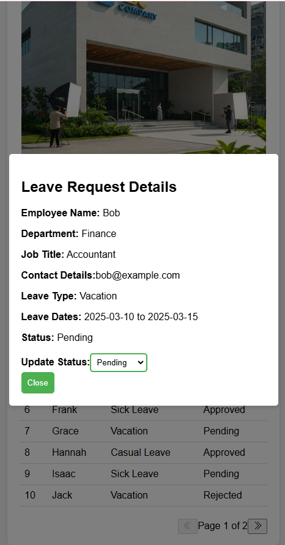

# Employee Leave Request App

This is a React-based web application designed to manage and display employee leave requests for a company. The app allows users to view a list of employee leave requests, search by employee name, and view detailed leave request information in a modal. It supports pagination to handle a large list of employees efficiently.

## Features

- **Employee List**: Displays a table of employees and their leave details such as leave type, status, and dates.
- **Search Functionality**: Allows users to search for employees by name.
- **Pagination**: Displays 10 employees per page, with the ability to navigate multiple pages.
- **Leave Request Modal**: Click on any employee row to view detailed information about their leave request in a modal.
- **Responsive Design**: The app is designed to be mobile-friendly and responsive.

 ## Technologies Used

- **React**: JavaScript library for building user interfaces.
- **CSS**: For styling the components and making the application visually appealing, use Bootstrap as well.
- **JavaScript**: For adding interactivity and logic to the app.

- ## Installation

1. Clone the repository:
  git clone https://github.com/Carol254/userPanel.git
  
2. Navigate into the project directory
     cd employee-leave-request-app
   
3. Install dependencies
   npm install
   
4. Run the application
   npm start

### Upon running the application, you'll be able to:
View the list of employee leave requests.
Search for employees by name.
Click on an employee to view detailed leave request information.
Navigate between pages of employees with pagination controls.

## Screenshots

### Leave Request Summary

*This screenshot shows a summary of all leave requests submitted by employees.*

### Employee Leave Search Page

*This screenshot shows the employee leave request page in the app.*

### Employee Leave Details

*This screenshot displays the employee leave details page.The admin can change the leave status*

